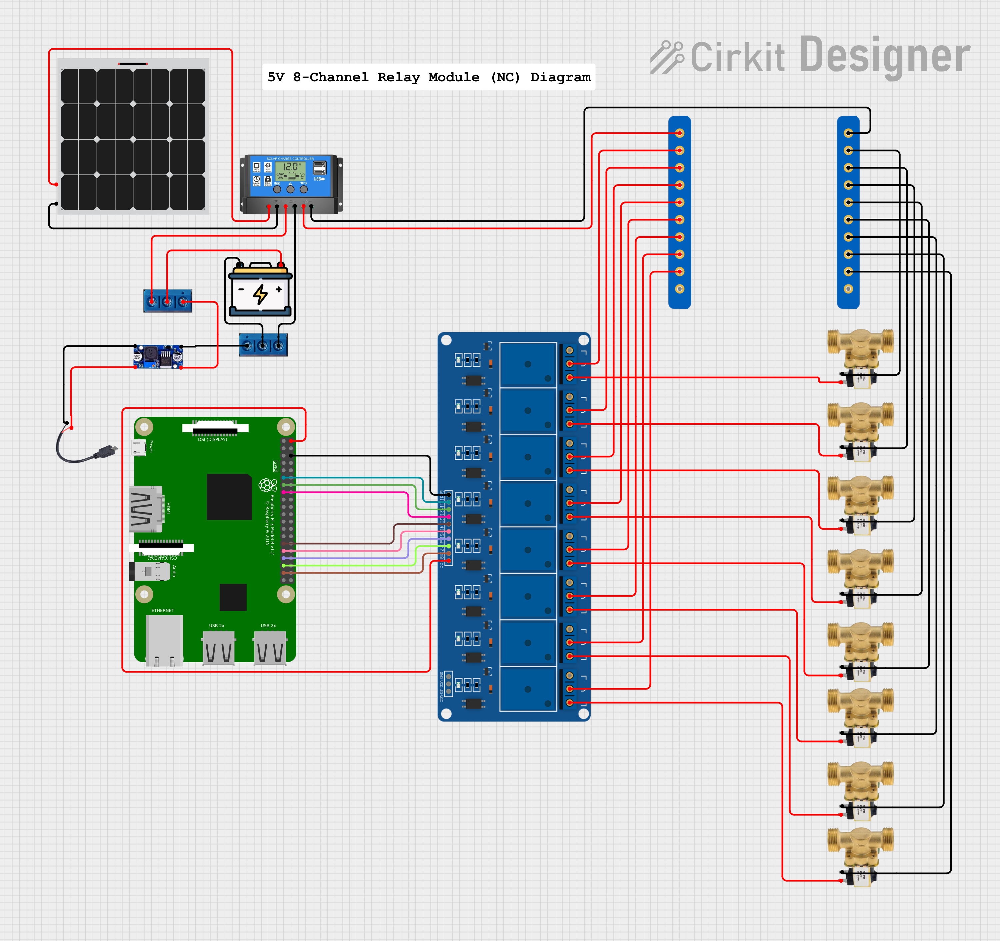

# Rhabon - A Solar Powered Smart Irrigation System

## Description

An automated irrigation system powered by solar energy, using multiple Raspberry Pi 3 B+ units controlling electrovalves via relay modules, coordinated by a central Node.js server running on a Raspberry Pi 5.

**Note:** The configuration and operation on the three Raspberry Pi 3 B+ units controlling electrovalves via relay modules will be identical, so there is only one Python script for all of them in the repository.

---

## Required Hardware

- 3 x Raspberry Pi 3 B+ (each managing a different zone: vineyard, berry patch, orchard)
- 1 x Raspberry Pi 5 (central server running Node.js API)
- 5V/12V Relay modules for controlling electrovalves (one per Raspberry Pi 3 B+)
- 12V Solenoid Electrovalves for irrigation
- Solar panels (to charge batteries)
- Rechargeable batteries (one per system)
- Necessary wiring and connectors

---

## Operating System, Languages and Libraries Used

- Ubuntu Server installed on each Raspberry Pi 3 B+ and Raspberry Pi 5
- Python (scripts on each Raspberry Pi 3 B+ to control relays and electrovalves)
- Python Libraries:
  - `RPi.GPIO`: Controls Raspberry Pi GPIO pins
  - `sys`: Handles command-line arguments and system exit
  - `json`: Parses pin configuration input in JSON format
  - `asyncio`: Manages concurrent timers for multiple pins
  - `signal`: Captures termination signals (e.g., Ctrl+C) for graceful shutdown
- Node.js (REST API server on Raspberry Pi 5)
- JavaScript (Web interface for control and monitoring)
- Node.js libraries for API creation (`Express`)

---

## System Architecture

- Each Raspberry Pi 3 B+ controls the electrovalves in its designated zone via relay modules.
- The Raspberry Pi 5 hosts a Node.js server exposing a REST API and a Web interface.
- Calling the API triggers the Python scripts on the corresponding Raspberry Pi 3 B+ to actuate the electrovalves.
- Each Raspberry Pi 3 B+ is powered by a battery charged through a solar panel.
- The Raspberry Pi 5 server is located indoor, connected to main power.

---

## Software Ecosystem

- Node.js REST API server for remote triggering of irrigation zones.
- Independent Python scripts running on each Raspberry Pi 3 B+ controlling the relays.
- Communication between the server and Raspberry Pis is done by connecting via SSH; each API endpoint, when called, will SSH into the target Raspberry Pi and run the Python script, passing the GPIO pin to actuate, the desired state (true/false), and the duration for which the state should be maintained.

---

## Goals

- Automate irrigation for multiple distinct agricultural zones.
- Use renewable solar energy for power.
- Centralized and accessible control via REST API.
- Scalability and modularity by separating zones across different devices.
- Web-based dashboard for real-time monitoring and manual control of irrigation zones.

---

## Hardware Diagram
> **⚠️ Warning:** *This configuration has not been tested on actual hardware yet. It may cause unexpected behavior and may slightly change soon.*

  
5V 8-Channel Relay Module (NC) Diagram

  

#### Wiring explanation

  

    
 <b>Raspberry Pi - Relay Module</b>

| Raspberry Pi Pin | Relay Module Pin |
| ---------------- | ---------------- |
| 5V               | VCC              |
| GND              | GND              |
| GPIO17           | IN1              |
| GPIO27           | IN2              |
| GPIO22           | IN3              |
| GPIO05           | IN4              |
| GPIO06           | IN5              |
| GPIO13           | IN6              |
| GPIO19           | IN7              |
| GPIO26           | IN8              |

  

  

    
 <b>Relay Module - Solenoid Valves</b>

| Relay Module    | Valve            |
| --------------- | ---------------- |
| NO (each relay) | VCC (each valve) |

  

  

    
 <b>COM Pin Node Module - Relay Module - Solar Charge Controller</b>

| COM Pin Node Module | Relay Module   | Solar Charge Controller |
| ------------------- | -------------- | ----------------------- |
| Entry 1             | –              | Load +                  |
| Entry 2             | COM (module 1) | –                       |
| Entry 3             | COM (module 2) | –                       |
| Entry 4             | COM (module 3) | –                       |
| Entry 5             | COM (module 4) | –                       |
| Entry 6             | COM (module 5) | –                       |
| Entry 7             | COM (module 6) | –                       |
| Entry 8             | COM (module 7) | –                       |
| Entry 9             | COM (module 8) | –                       |

  

  

    
 <b>GND Pin Node Module - Valves - Solar Charge Controller</b>

| GND Pin Node Module | Valve         | Solar Charge Controller |
| ------------------- | ------------- | ----------------------- |
| Entry 1             | –             | Load -                  |
| Entry 2             | GND (valve 1) | –                       |
| Entry 3             | GND (valve 2) | –                       |
| Entry 4             | GND (valve 3) | –                       |
| Entry 5             | GND (valve 4) | –                       |
| Entry 6             | GND (valve 5) | –                       |
| Entry 7             | GND (valve 6) | –                       |
| Entry 8             | GND (valve 7) | –                       |
| Entry 9             | GND (valve 8) | –                       |

  

  

    
 <b>Solar Panel - Solar Charge Controller</b>

| Solar Panel | Solar Charge Controller |
| ----------- | ----------------------- |
| VCC/+       | Solar Cell +            |
| GND/-       | Solar Cell -            |

 

  

    
 <b>Solar Charge Controller - Positive PIN Node - Battery - Buck Converter</b>

| Solar Charge Controller | Positive PIN Node | Battery | Buck Converter |
| ----------------------- | ----------------- | ------- | -------------- |
| VCC/+                   | PIN 1             | –       | –              |
| –                       | PIN 2             | VCC/+   | –              |
| –                       | PIN 2             | –       | IN+            |

 

  

    
 <b>Solar Charge Controller - Negative PIN Node - Battery - Buck Converter</b>

| Solar Charge Controller | Negative PIN Node | Battery | Buck Converter |
| ----------------------- | ----------------- | ------- | -------------- |
| GND/-                   | PIN 1             | –       | –              |
| –                       | PIN 2             | GND/-   | –              |
| –                       | PIN 3             | –       | IN-            |

 

  

    
 <b>Buck Converter - Raspberry Pi Charger</b>

| Buck Converter | Raspberry Pi Charger |
| -------------- | -------------------- |
| OUT-           | GND/-                |
| OUT+           | VCC/+                |

 

 

  
12V 16-Channel Relay Module (NC) Diagram

  Not ready yet

---

## Additional Details and Future Plans

- Fans for each system to prevent overheating.
- Implement battery and solar panel monitoring to track charge levels and optimize energy usage.
- Introduce sensor integration (e.g., soil moisture, temperature, humidity) for smarter, automated irrigation decisions.
- Enhance security by implementing encrypted communication between the server and Raspberry Pis.
- Enable scheduling and automation rules directly within the API for more flexible irrigation control.
- Add logging and alerting features to notify of failures or low battery states.
- Implementation of a physical button on each Raspberry Pi 3 B+ for manual control of the electrovalves, with the operating time configurable through the server/web interface.
- Development of a local scheduling mechanism to automatically execute irrigation programs, functioning even without an internet connection.
- Integration of a SIM card module to provide internet connectivity in areas without Wi-Fi, enabling remote access and control at all times.

---

## License

This project is licensed under the **Creative Commons Attribution-NonCommercial 4.0 International (CC BY-NC 4.0)** License.  
You may use, modify, and share this code **for non-commercial purposes only**, as long as you credit the author.

For commercial use, please contact the author for permission.
